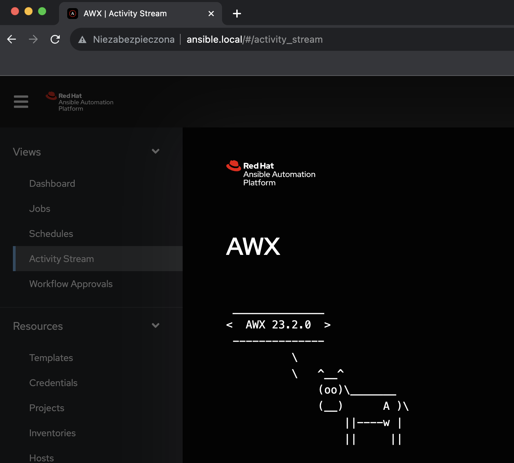

# Ansible AWX installation 

AWX Operator 2.19.1 & AWX 24.6.1 based on Lightweight Kubernetes k3s engine

Tested on RHEL9 (selinux disabled)

Usage:

git clone https://github.com/pkoperwas/Ansible-AWX-installator.git

ansible-playbook install_awx.yml 

